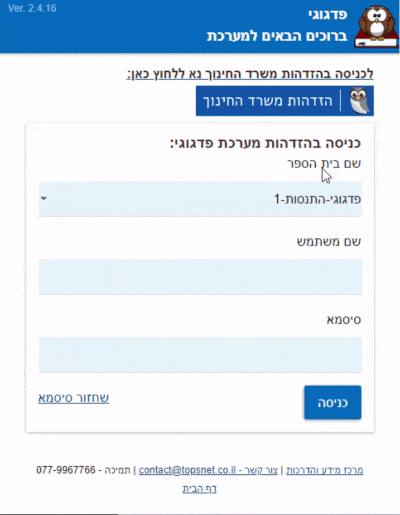
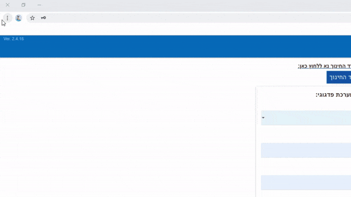

# כניסה למערכת
**דף זה יפרט את הדרכים להיכנס למערכת באמצעים השונים**

[לכניסה לפדגוגי לחצו כאן](https://pedagogy.co.il/teacher.html#!/login)

זהו מסך הכניסה לפדגוגי

ניתן להיכנס באמצעות שם המשתמש והסיסמה שניתנו לכם ע"י אחראי התקשוב בבית הספר, או באמצעות שם משתמש וסיסמה של משרד החינוך דרך הקישור הבא:

# **צרו קיצור דרך במחשב או בסמארטפון לכניסה מהירה**

