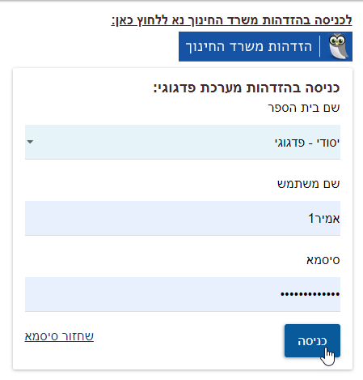
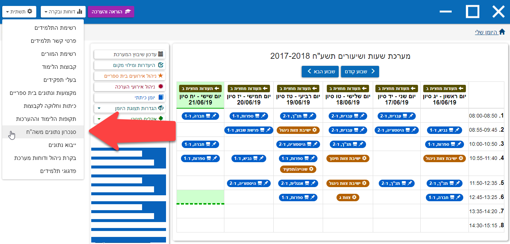
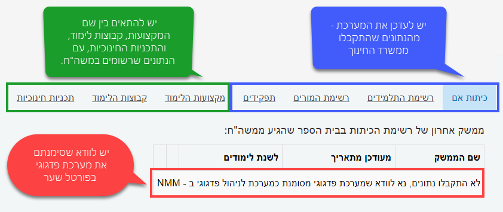

# הוראות הצטרפות בית ספר חדש
**ברוכים הבאים לפדגוגי! במספר שלבים פשוטים תוכלו להנות משלל האפשרויות שיש למערכת שלנו להציע**

היכנסו ל[פורטל מוסדות חינוך (שער)](http://edu.gov.il/sites/Shaar/Pages/HomePage.aspx) --> בתי ספר --> ניהול נתוני בית הספר

תחת הקטגוריה `ניהול פדגוגי` תצטרכו להסיר את הרשומה, במידה וקיימת, ולהוסיף רשומה של **ניהול פדגוגי - טופסנט**, וביצירת קבוצות, להגדיר רשומה נוספת **טופסנט – פדגוגי**. 

לאחר שהגדרתם את פדגוגי כמערכת לניהול פדגוגי ו/או ניהול קבוצות, יש לחכות כ-24 שעות, עד לקבלת הנתונים ממשדר החינוך.

בזמן הזה יש ליצור קשר עם [מוקד התמיכה](https://pedagogy.co.il/pages/contact.html) של פדגוגי, כך שבזמן ההמתנה נוכל להקים לכם את בית-הספר במערכת, ולהיערך לקבלת הנתונים מהפורטל, ותחילת העבודה עם בית הספר.

בשיחה נתאם איתכם זמן מתאים לפגישת תדרוך אינטרנטית או אישית, לכם או לרכז/ת התקשוב בבית הספר ולמשבץ האחראי.

לאחר שקיבלתם הודעה על העברת נתוני בית הספר למערכת בהצלחה, יש להיכנס [למערכת פדגוגי דרך משרד החינוך](https://pedagogy.co.il/api/v1/student/auth/login/idm) (ניתן לשנות סיסמה במידת הצורך).

בכל שלב , ניתן ליצור קשר עם [מוקד התמיכה](https://pedagogy.co.il/pages/contact.html) שלנו.

לאחר כניסתכם למערכת, לחצו על תפריט תשתית --> סנכרון נתונים משרד החינוך.

