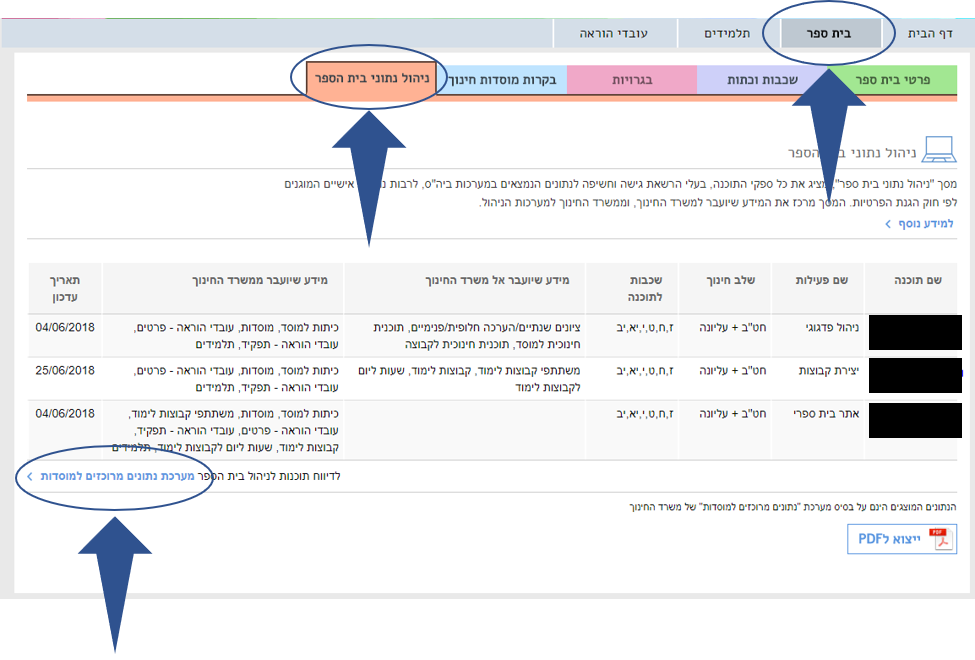

# הוראות הצטרפות בית ספר חדש
**ברוכים הבאים לפדגוגי! במספר שלבים פשוטים תוכלו להנות משלל האפשרויות שיש למערכת שלנו להציע**

היכנסו ל[פורטל מוסדות חינוך (שער)](http://edu.gov.il/sites/Shaar/Pages/HomePage.aspx) --> בתי ספר --> ניהול נתוני בית הספר

תחת הקטגוריה `ניהול פדגוגי` תצטרכו להסיר את הרשומה, במידה וקיימת, ולהוסיף רשומה של **טופסנט - פדגוגי**, ו`ביצירת קבוצות`, להגדיר רשומה נוספת **טופסנט – פדגוגי**. 

לאחר שהגדרתם את פדגוגי כמערכת לניהול פדגוגי ו/או ניהול קבוצות, יש לחכות כ-24 שעות, עד לקבלת הנתונים ממשדר החינוך

בנוסף עלינו לתאם איתכם שעת הדרכה למורים, שעת הדרכה לרכז/ת התקשוב, ולמשבץ.

בזמן הזה אנו נקים עבורכם את בית הספר. עד לקבלת הנתונים המלאים יש להכין את הנתונים הבאים:

1. מספר כיתות, מורים,תלמידים.
2. סמל מוסד, מספר מוסד, ארגון הרשאות למורים - מחנכים, מנהלי מערכת
3. 

לאחר שקיבלתם הודעה על העברת נתוני בית הספר למערכת בהצלחה, יש להיכנס [למערכת פדגוגי דרך משרד החינוך](https://pedagogy.co.il/api/v1/student/auth/login/idm) (ניתן לשנות סיסמה במידת הצורך).

בכל שלב , ניתן ליצור קשר עם [מוקד התמיכה](https://pedagogy.co.il/pages/contact.html) שלנו.

[שלבי הכנת בית ספר חדש](new-school-start/README.md)

[חזרה לתפריט הראשי](../README.md)