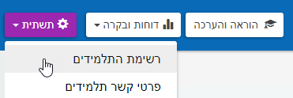

# הגדרות ראשוניות ותחילת עבודה
**לפני שנתחיל, מספר עצות פשוטות לייעול העבודה בהמשך**

1. **תלמידים**

תשתית --> תלמידים

וודאו כי כלל התלמידים הוזנו במערכת כראוי, ופרטיהם מלאים.

אם לא, ניתן לערוך רשומות או להוסיף רשומה חדשה בקלות.

