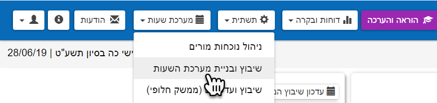
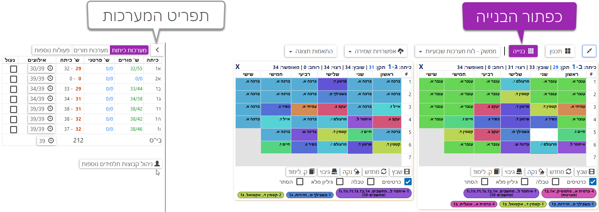
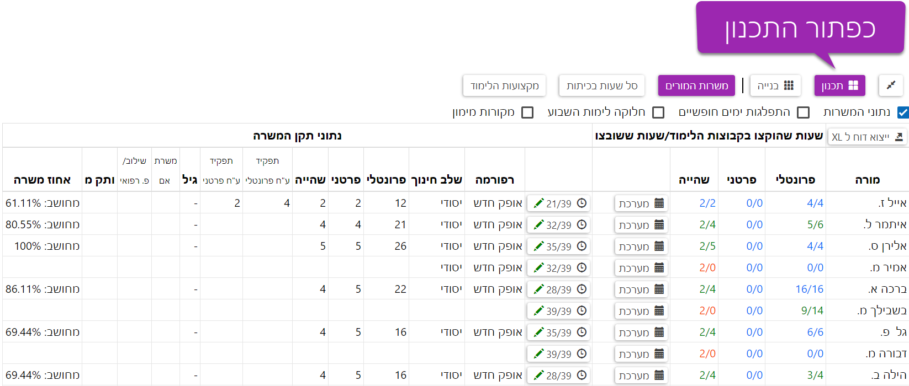

# מערכת לשיבוץ שעות
המערכת שתחסוך לכם שעות בהייה מיותרת על לוח מלא במחיקות

המערכת מחולקת ל-2 חלקים מרכזיים: תכנון ובנייה.

במסך התכנון נזין למערכת את כלל האילוצים של המורים, הכיתות והמקצועות.

במסך הבנייה ניתן למערכת לשבץ אוטומטית את המורים לפי האילוצים, ולאחר מכן נמשיך בסודוקו לפי התכנית.

כדי להיכנס למערכת לחצו על כפתור "מערכת שעות" --> שיבוץ ובניית מערכת שעות.

במסך שייפתח, תוכלו לראות מצד ימין את כפתורי תכנון ובנייה, ומצד שמאל את אפשרויות התצוגה. במרכז המסך יופיעו מערכות השעות שלכם. 

ומסך התכנון

בכל שלב תוכלו להגדיל את המסך, לעבודה נוחה יותר, באמצעות לחיצה על כפתור F11 במקלדת, וכן לחיצה על הכפתור 

להמשך הדרכה על מסך תכנון [לחצו כאן](../plan/README.md).

לדילוג על השלב ולמעבר למסך הבנייה [לחצו כאן](../build/README.md).
