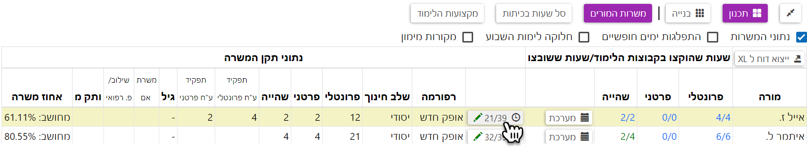
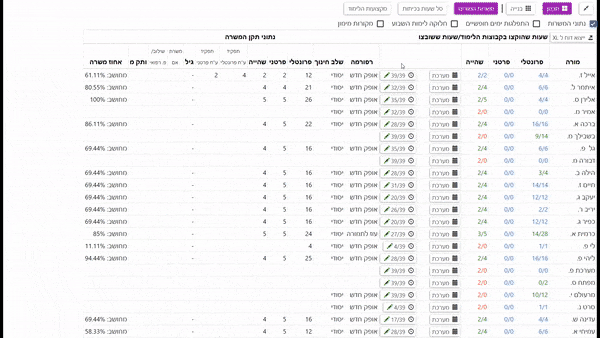
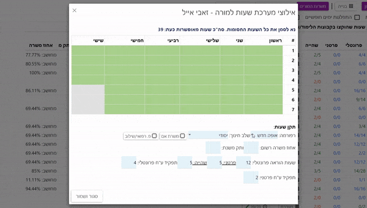
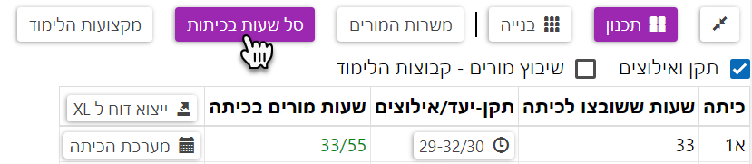
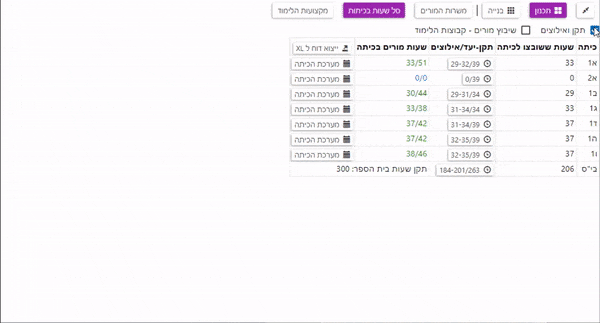

# מסך התכנון
מי שמאלץ, מתאלץ

**קביעת אילוצי שעות למורים**

לחצו על כפתור תכנון --> משרות המורים --> נתוני המשרות

בטבלה שנפתחה לחצו על "שעון האילוצים" של המורה הרצוי.

במסך הבא תוכלו לקבוע את אילוצי שעות המורים, כמו כן תוכלו לקבוע את תקן המשרה של המורה.

קביעת אילוצי שעות:

קביעת תקן משרה:

**קביעת אילוצי שעות לכיתות**

לחצו על כפתור תכנון --> סל שעות בכיתות --> תקן ואילוצים

במסך הבא תוכלו לקבוע את שעות הלימוד של הכיתות:

**קביעת אילוצי שעות למקצועות**

לחצו על כפתור תכנון --> מקצועות הלימוד --> הגדרת אילוצים

במסך הבא תוכלו לקבוע את אילוצי השעות למקצוע:

לאחר שסיימנו לקבוע את האילוצים, נעבור לשלב הבנייה.

למעבר 